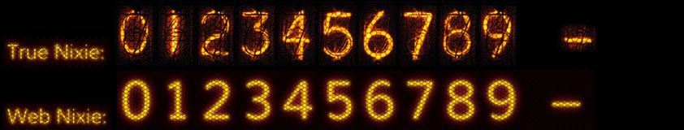

# nixie

###About

nixie is jQuery-based tiny visual component, that makes your text look like Nixie tubes from science labs.

https://nkapliev.github.io/nixie/  
https://en.wikipedia.org/wiki/Nixie_tube





###The story

When I was studying at an university I loved laboratory classwork because of nixie tubes.  
It was amazing feeling when you make science by looking on this flicker shiny digits :heart_eyes:   
But old science devices live not so long: they are often broken down, replaced by new, or even thrown to the dump :rage1:  
So I've decided to immortalize nixie tubes in Web.  
They look pretty nice, aren't they? :rocket: :star2: :whale2:


###How to use

```
...
<script type="text/javascript" src="https://rawgit.com/nkapliev/nixie/master/nixie.js"></script>
<link rel="stylesheet" href="https://rawgit.com/nkapliev/nixie/master/nixie.css">
...
<div id="some-nixie-html-value-id">111</div>
<div id="some-nixie-js-value-id"></div>
...
<script>
$('#some-nixie-html-value-id').nixie();
$('#some-nixie-js-value-id').nixie({ value: '222' });
</script>
```

###Dependencies

`jQuery: ^2.x.x`